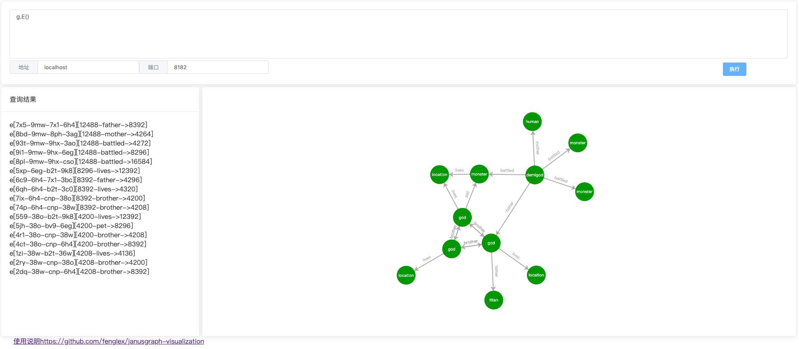

# janusgraph-visualization

A simple tool for janusgraph visualization.



View janusgraph with tools.

How to run ?

Download release jar file
```$xslt
nohup java -jar janusgraph-visualization-x.x.x.jar >/dev/null 2>&1&
```

Then browser open http://localhost:8888

If you want to modify port
```$xslt
java -jar janusgraph-visualization-x.x.x.jar --server.port=80
```
Run with docker 
```aidl
docker pull fenglex/janusgrpah-visualization
docker run -itd -p 80:8888 fenglex/janusgrpah-visualization
```
Then browser open http://localhost:80

