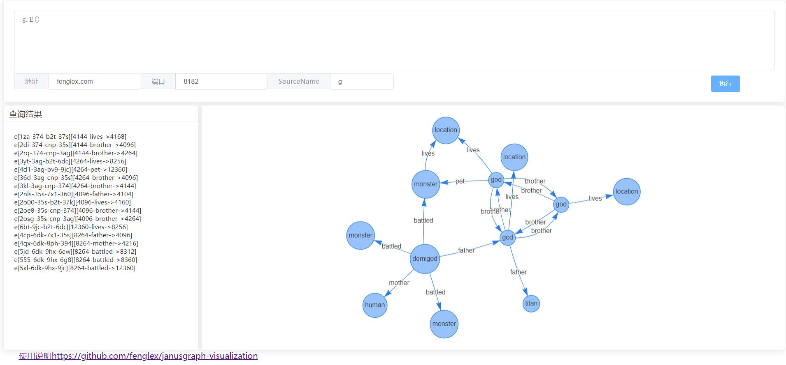

# janusgraph-visualization
A simple tool for janusgraph visualization.  
(一个简单的janusgraph查询可视化工具)



View janusgraph with tools.

How to run ?

Download release jar file
```$xslt
nohup java -jar janusgraph-visualization-x.x.x.jar >/dev/null 2>&1&
```

Then browser open http://localhost:8888

If you want to modify port
```$xslt
java -jar janusgraph-visualization-x.x.x.jar --server.port=80
```
Run with docker 
```
docker pull fenglex/janusgraph-visualization
docker run -itd -p 80:8888 fenglex/janusgraph-visualization
```
Then browser open http://localhost:80

已知问题：
1、两点之间有三条以上边可能会有问题（考虑使用G6替换展示可以解决，但最近没时间修改）

有问题可以：fenglex@126.com
